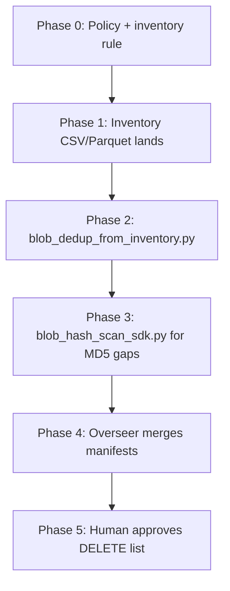

# Azure Blob Dedup — 100% Certainty

## Non-negotiable rule

**Never delete or recommend delete unless certainty = `PROVEN_EXACT`.**

| Certainty | Meaning | Allowed action |
|-----------|---------|----------------|
| `PROVEN_EXACT` | Same non-empty `Content-MD5` **and** same `Content-Length` on block blobs | List as duplicate; delete copies after canonical pick |
| `PROVEN_EXACT_COMPUTED` | MD5 missing on one/both; SHA-256 computed over full blob bytes; digests match | Same as above |
| `SUSPECT` | Same size only, or same name, or prefix-count match | **Investigate only — never delete** |
| `REJECTED` | Length mismatch despite MD5 match (corrupt metadata) | Manual review |

Azure does not provide a built-in cross-container duplicate finder. Use **Blob Inventory** at scale, then this repo's scripts.

References:
- [Blob inventory](https://learn.microsoft.com/en-us/azure/storage/blobs/blob-inventory)
- [Find duplicates (Content-MD5)](https://learn.microsoft.com/en-us/answers/questions/5883631/how-do-i-find-duplicate-files-in-blob-storage)

---

## Pipeline (5 phases)



### Phase 0 — Enable inventory

- Policy: `Azure blob dedup/policies/blob-inventory-dedup.json`
- Destination container: `inventory-reports` (create if missing)
- Schema: `Name`, `Content-Length`, `Content-MD5`, `Last-Modified`, `BlobType`, `Etag`
- Schedule: `daily` (first run may take hours on 6M+ blobs)

### Phase 1 — Ingest report

- Parse latest manifest under `inventory-reports/.../blob-inventory-dedup/`
- Dedupe inventory rows by `Name` + `VersionId` (inventory can duplicate rows)

### Phase 2 — Inventory analyzer

```bash
python3 scripts/blob_dedup_from_inventory.py \
  --inventory-csv /path/to/inventory.csv \
  --output-dir artifacts/dedup \
  --account menageriesa36965
```

Output:
- `proven_exact_groups.jsonl` — groups with 2+ blobs, all `PROVEN_EXACT`
- `delete_candidates.csv` — non-canonical copies only
- `suspects.jsonl` — same-size groups without MD5

### Phase 3 — SDK hash pass (gaps + priority containers)

For blobs with empty MD5 or priority containers (`gmail-takeout`, `ice-cold-triage`, etc.):

```bash
python3 scripts/blob_hash_scan_sdk.py \
  --containers gmail-takeout,ice-cold-triage \
  --output-dir artifacts/dedup \
  --verify-bytes  # re-read both blobs and compare bytes for PROVEN_EXACT_COMPUTED
```

### Phase 4 — Overseer merge

- Single `MASTER_DEDUP_MANIFEST.csv` with columns: `certainty`, `action`, `keep_container`, `keep_blob`, `delete_container`, `delete_blob`, `content_length`, `content_md5`, `sha256_computed`
- Reject any row not `PROVEN_EXACT*`

### Phase 5 — Human delete (RED zone)

- No automated deletes in this skill
- Use generated `az storage blob delete` commands or lifecycle policy after sign-off

---

## Canonical copy selection (deterministic)

When multiple blobs share MD5 + length, **keep** the first by sorted key:

1. Prefer container in allowlist: `discovery`, `evidence-*`, `legal-*` over `backups`, `uploads`, `ice-cold-triage`
2. Shorter blob path (fewer `/` segments)
3. Newest `Last-Modified` if tie

All others → `delete_candidates.csv`.

---

## Orchestration (4 agents + overseer)

See `Azure blob dedup/ORCHESTRATION.md`.

| Agent | Role |
|-------|------|
| AG-1 INVENTORY | Policy deploy, manifest polling |
| AG-2 ANALYZER | `blob_dedup_from_inventory.py` + unit tests |
| AG-3 SCANNER | `blob_hash_scan_sdk.py` on priority containers |
| AG-4 MANIFEST | Merge outputs, stats, DELETE CSV |

**Overseer (primary):** branch, commits, agent handoffs, run end-to-end, block non-PROVEN rows.

---

## Files in this repo

| Path | Purpose |
|------|---------|
| `Azure blob dedup/SKILL.md` | This skill |
| `Azure blob dedup/ORCHESTRATION.md` | Agent runbook |
| `Azure blob dedup/policies/blob-inventory-dedup.json` | Inventory policy template |
| `scripts/blob_dedup_from_inventory.py` | Analyze inventory export |
| `scripts/blob_hash_scan_sdk.py` | Live SDK list + hash |
| `scripts/requirements-dedup.txt` | Python deps |

---

## Storage account

Default account from env: `AZURE_STORAGE_ACCOUNT` (e.g. `menageriesa36965`).

Auth order: `AZURE_STORAGE_CONNECTION_STRING` → account key env → `DefaultAzureCredential`.
